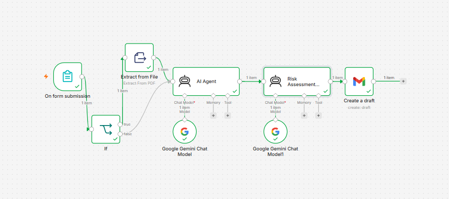

# AI Security Risk Assessment Workflow

> An AI-powered n8n workflow that summarizes PDF documents and meeting notes, identifies cybersecurity risks, ranks them by severity, and automatically creates a professional Gmail draft using Google Gemini.


---

## Project Overview

Organizations often review long audit reports, compliance documents, and meeting notes to identify important security issues. Manually reading and summarizing these documents can take time and may delay important follow-up actions.

This project automates that process using n8n and Google Gemini. The workflow accepts meeting notes or a PDF document, extracts the document content, generates a clean executive summary, identifies key cybersecurity risks, ranks them by severity, and creates a professional Gmail draft that is ready for review.

The goal of this project is to demonstrate how workflow automation and generative AI can be combined to improve document review, cybersecurity analysis, and business communication.

---

## Key Features

* Accepts PDF documents and meeting notes as input
* Extracts text from uploaded PDF files
* Generates an executive summary, key points, and action items
* Uses a second AI agent to identify cybersecurity risks
* Classifies risks as Critical, High, or Medium
* Prioritizes the top three risks
* Generates a concise professional email draft
* Automatically creates the draft in Gmail
* Uses a modular multi-agent workflow design

---

## Software Development Methodology

This project was developed using an Agile-inspired iterative development approach. Each component of the workflow was designed, tested, and improved individually before integrating the complete automation.

### Development Phases

1. Requirement Analysis
   - Define the project objective
   - Identify workflow inputs and outputs
   - Determine automation requirements

2. Workflow Design
   - Design the n8n workflow architecture
   - Create the document processing pipeline
   - Define interactions between AI agents

3. AI Prompt Engineering
   - Develop prompts for document summarization
   - Develop prompts for cybersecurity risk assessment
   - Optimize prompts for consistent structured outputs

4. Integration
   - Connect Google Gemini AI
   - Configure Gmail draft generation
   - Configure PDF text extraction

5. Testing
   - Test using sample meeting notes
   - Test using PDF documents
   - Verify generated summaries
   - Verify risk classifications
   - Verify Gmail draft formatting

6. Documentation
   - Prepare workflow documentation
   - Capture workflow screenshots
   - Document installation and usage instructions

This iterative methodology allowed each workflow component to be validated independently before combining them into the final automation.

---

# System Architecture

The workflow is composed of six main stages that work together to automate cybersecurity document analysis.

```text
PDF / Meeting Notes
        │
        ▼
 PDF Text Extraction
        │
        ▼
 AI Agent 1
(Document Summarization)
        │
        ▼
 AI Agent 2
(Risk Assessment)
        │
        ▼
 Gmail Draft Generation
        │
        ▼
 Professional Security Email
```

## Workflow Diagram



The workflow first extracts text from the uploaded document, generates an executive summary, identifies cybersecurity risks using a dedicated AI agent, prioritizes the most critical findings, and finally prepares a professional Gmail draft ready for review.

---

# Technologies Used

| Technology | Purpose |
|------------|---------|
| n8n | Workflow automation platform |
| Google Gemini | AI document summarization and cybersecurity risk analysis |
| Gmail | Automatic email draft generation |
| PDF Extract Node | Extracts text from uploaded PDF documents |
| JavaScript Expressions | Parse AI outputs for Gmail subject and message |
| Markdown | Project documentation |

---

# Software Requirements

The following software and services are required to run this project:

- n8n (latest stable version)
- Google Gemini API access
- Gmail account
- Gmail OAuth credentials configured in n8n
- Internet connection
- Modern web browser

---

# Input

The workflow accepts either of the following inputs:

### Option 1 — PDF Document

A PDF containing:

- Security audit reports
- Compliance reports
- Meeting minutes
- Risk assessment reports
- Technical documentation

### Option 2 — Meeting Notes

Plain text meeting notes describing security findings, audit observations, or operational updates.

---

# Output

After processing, the workflow automatically generates:

- Executive Summary
- Key Points
- Action Items
- Top 3 Cybersecurity Risks
- Risk Level (Critical / High / Medium)
- Recommended Mitigations
- Professional Gmail Draft

The Gmail draft is automatically created and saved for user review before sending.
